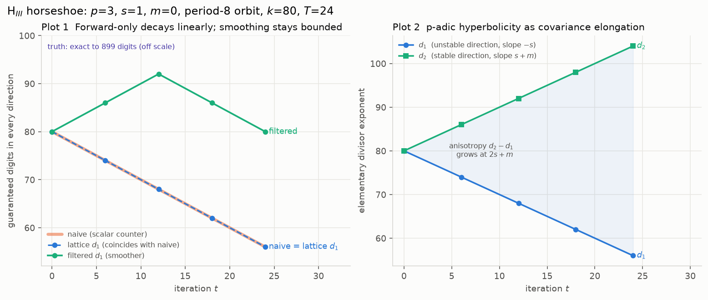
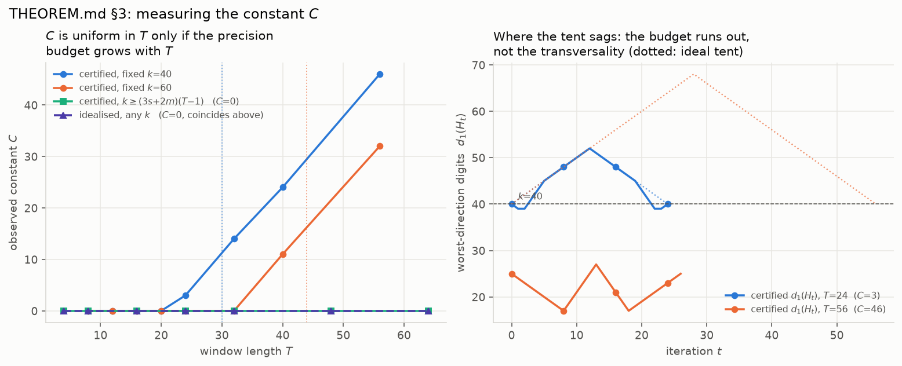

# p-adic Hénon: precision tracking as a filtering problem

The Caruso–Roe–Vaccon lattice-precision
recursion is a Kalman **prediction** step; this repo adds the missing **update**
step and the **smoother** that follows from it, on the non-archimedean Hénon map

```
f(x, y) = (y, y² + c − δx)        J(x,y) = [[0, 1], [−δ, 2y]]      det J = δ
```

Everything is exact — integers and `Fraction`s, never floating point — so every
claim the filter makes is *certified* against ground truth rather than assessed
statistically. `v_true ∈ v + H` is asserted at every step of every track.

> **Status (2026-07-27).** The headline claims are **theorems**: **`docs/NOTE.md`**
> proves the exact four-divisor tent law (Theorem A — unconditional, aperiodic
> orbits included) and the sharp certified budget `k ≥ (3s+2m)(T−1)`
> (Theorem B′, an iff). Where a constant in this README disagrees, `docs/NOTE.md`
> wins: the certified budget is `(3s+2m)(T−1)`, not `(3s+m)T` (`3s+m` is the
> forward rate only). **Tier-0 code debt is now closed** — both `budget()`
> functions compute the sharp value and assert that neither pass inflated, and
> `exp_5_2` asserts both exactness horizons as exact equalities with an
> `iff` boundary sweep. **The generalised theorem is now written and proved**
> (`docs/NOTE.md` §6, Theorem C: the four-divisor law for any sequence in
> `GL₂(Q_p)` obeying two cone axioms, with Theorem A as a corollary).
> `docs/NOTE.md` is self-contained and ready to send to an external
> collaborator; **`docs/OVERVIEW.md`** is the short read-this-first document
> for one. Forward plan: **`docs/ROADMAP.md`**; documentation map at the
> bottom of this file.

## The result

In the horseshoe regime `H_III` (ADP region, `|c| > max(1, |δ|²)`), where the
Jacobian's eigenvalue valuations are `{−s, s+m}` — genuine expansion *and*
contraction:

| track | worst-direction digits over 24 steps, `k = 80`, `s = 1` |
|---|---|
| naive (scalar counter) | 80 → 56, linear decay |
| lattice (predict only) | 80 → 56, linear decay (identical to naive) |
| **filtered (smoother)** | **never below 80, peaks at 92** |



The forward pass loses `s` digits per step in the unstable direction; the
backward pass loses them in the *stable* direction; intersecting the two cosets
at each time gives the bounded tent `k + min(t, T−t)·s`. This is a
Rauch–Tung–Striebel smoother that is exact rather than Gaussian, and it exists
precisely because Hénon is an automorphism.

Note the first two rows are *equal*: in the horseshoe the lattice buys nothing
over a scalar counter in its weakest direction. Its entire advantage in the
prediction-only setting is the anisotropy `d₂ − d₁` (right-hand panel above),
which grows at `2s + m`. The bounded precision comes from the update step, not
from the lattice representation alone.

## Regimes

Parameters come from Allen–DeMark–Petsche, *Non-archimedean Hénon maps,
attractors, and horseshoes* ([arXiv:1610.04271](https://arxiv.org/abs/1610.04271)),
via the dictionary `a = −c`, `b = −δ`. `padic_filtering/params.py` cites the
result behind each parameter set; `docs/REFERENCES.md` is the bibliography.

| region | condition | eigenvalue valuations | what it is good for |
|---|---|---|---|
| `H_I` | `v_p(c) ≥ 0`, `m = 0` | `{0, 0}` | nothing — unimodular, a no-op |
| `H⁺_II` | `v_p(c) ≥ 0`, `m ≥ 1` | `{0, m}` | anisotropy demo only; **the smoother is vacuous here** (`F ∩ B = F`) |
| `H_III` | `\|c\| > max(1, \|δ\|²)` | `{−s, s+m}` | the filtering demo |

`H⁺_II` is nonexpanding, so the forward pass never loses and there is nothing
for a smoother to recover. That is asserted, not assumed — see
`exp_5_3_smoother.py`, panel 3.

## Running it

```bash
uv run pytest                          # 215 tests, ~5s
uv run python experiments/run_all.py   # every experiment; figures + JSON in results/
uv run python review_checks.py         # the original review numbers
```

Each experiment writes `results/<name>.png` and `results/<name>.json`; the JSON
carries every parameter, the full per-step numbers, and a verdict string.

## Results

| experiment | verdict |
|---|---|
| 5.1 anisotropy (kill criterion) | **PASS.** Slope `m` in `H⁺_II`, `2s+m` in `H_III`, asserted for `p ∈ {3,5,7}`. Tangency orbits kink instead — recorded, not hidden. |
| 5.2 exactness horizon | **PASS, as exact equalities.** Both horizons match `docs/NOTE.md` Prop 4.4 exactly — `(k−m)/(3s+m)+2` forward, `k/(3s+2m)+2` backward — over six regimes with `s ∈ {0,1,2}`, `m ∈ {0,1,2}`. Prop 4.4's *iff* is checked in both directions (`k` clean, `k−1` inflates). Updates push the forward horizon from 6 to 12. |
| 5.3 smoother | **PASS in `H_III`**, on periodic orbits of period 1–20 (variable Jacobian), transversality defect exactly 0. **Vacuous in `H⁺_II`**, as predicted. |
| 5.4 certification | **PASS.** Zero violations in 10⁴ random orbits, with a mutation control that *is* caught. |
| 5.5 slack | **PASS, better than predicted.** Slack 0 at every step: inflation is tight, not merely conservative. |
| 5.6 baseline | **PASS** against `review_checks.py` (independent implementation). SageMath comparison **skipped** — not installed. |
| probabilistic | **PASS.** Exact rational posteriors on the 1D noisy-digit variant. |
| `docs/THEOREM.md` §3 | **Constant measured: `C = 0`, and since proved.** Unconditionally for the idealised lattices; for certified ones iff `k ≥ (3s+2m)(T−1)` (`docs/NOTE.md` Thm B′). See below. |

### The theorem

`docs/THEOREM.md` conjectures a constant `C`, uniform in `T`, `t` and the orbit,
with `d₁(H_t) ≥ k + s·min(t, T−t) − C`. `experiments/exp_theorem.py` measures
it, and the answer sharpens the statement in both directions:

- For the lattices the theorem defines (pure Jacobian products) `C = 0` with
  **no hypothesis** — the tent is attained, not just bounded. Verified for
  `T ≤ 100`, `k ≥ 0`, periods 1–20, `p ∈ {3,5,7,11}`, `s ∈ {1,2,3}`,
  `m ∈ {0,1,2}`.
- For *certified* lattices, both passes stay exact iff the starting precision
  honours `k ≥ (3s+2m)(T−1)` — sharp, and an iff (`docs/NOTE.md` Thm B′; the
  `(3s+m)T` written elsewhere in this repo is the forward rate and is
  sufficient only when `m = 0`). At fixed `k` the constant grows once `T`
  outruns the exactness horizon (`k=40`: `C = 0, 0, 3, 14, 24, 46` for
  `T = 16, 20, 24, 32, 40, 56`), so the claim "independent of `T`" is false
  without that hypothesis.
- The cause is the quadratic-remainder budget, **not** the stable/unstable
  transversality that `docs/THEOREM.md` §4 expected `C` to come from: the
  transversality defect is `0` in every configuration measured, including
  every one with `C > 0`.
- The law is *skewed* when `δ` is not a unit: the backward pass loses `s+m`
  digits per step where the forward loses `s`, so
  `d₁(H_t) = k + min((s+m)·t, s·(T−t))` and the peak sits at `t* = sT/(2s+m)`,
  not `T/2`. The symmetric tent used elsewhere in this repo is the `m = 0`
  case (which is what the horseshoe demos use).



### Three findings worth flagging

**Tangencies break the clean slope law.** In `H⁺_II` over `ℚ₅` with the ADP
Table 1 candidate `(a,b) = (1,5)`, the orbit from `(1,1)` has `v_p(y_t) = 1` at
every odd step. The middle Newton-polygon vertex leaves the lower hull, the
eigenvalue valuations ramify to `m/2`, and the anisotropy oscillates instead of
climbing. The nonexpanding property and `det J = δ` still hold and are asserted;
the slope-`m` law is asserted only where it is claimed to hold.

**The precision floor is not optional.** Past `d₁ < −s` the coset is wider than
the invariant set, and because the map is quadratic the remainder module then
*squares* the uncertainty every step — lattice exponents double per iteration
(−2, −4, −8, … −2048). Mathematically correct, informationally worthless, and a
memory hazard. Tracks stop at the floor and report it
(`precision.PrecisionExhausted`).

**Unscaled coordinates, not scaled.** The obvious move is to track in scaled
coordinates `X = p^s x`. Those put the orbit in `Z_p²`, but the scaled update
divides by `p^s`, and that division is exact *only on the invariant set*. Once
`d₁ < 0` the canonical coset representative can leave the horseshoe and the
arithmetic dies. Scaling is by the scalar matrix `p^s I`, which shifts every
lattice exponent uniformly and changes no rate, slope or tent — so the trackers
iterate the *unscaled* polynomial map, which has no division and is defined
everywhere. `Henon.f_scaled` keeps the scaled form and documents the argument.

## Layout

```
padic_filtering/
  padic.py          v_p, unit parts, Z/p^N helpers, Hensel square roots
  lattice.py        rank-2 lattices in Q_p^2 as (M, e); HNF/SNF over Z_p,
                    membership, image, intersection, duals, coset intersection
  henon.py          the map, its inverse, Jacobians, periodic orbits by Newton
  params.py         ADP-backed parameter sets, each citing its theorem
  precision.py      naive / lattice / filtered trackers, certification,
                    exactness test, inflation, precision floor
  probabilistic.py  exact posteriors over the depth-k p-ary tree (1D)
experiments/        one script per §5 experiment + headline plots
tests/              215 tests; HNF/SNF bugs are silent, so they are not
                    optional; test_proof_lemmas.py pins every identity the
                    proofs in docs/NOTE.md use as an exact numerical
                    assertion, and test_cone_axioms.py checks the same law on
                    matrix sequences that are not Henon Jacobians (§6 there)
```

### Representation notes

Lattices are stored as `p^(−e)·M Z_p²` with `M = [[p^a, 0], [b, p^d]]`,
`0 ≤ b < p^d` — the Hermite form over `Z_p`, which is a local PID, so units
divide out and the representation is **canonical**. Lattice equality is tuple
equality; there is no "different basis, same lattice" failure mode. `d₁` may be
negative: in `H_III` the expanding direction pushes `H` outside `Z_p²`, which
is exactly the statement that digits have been lost.

Coset representatives are reduced modulo their own lattice after every step.
This is required for the coset to stay canonical, and it is also what stops the
exact rational arithmetic from doubling in size every iteration — the map
squares its argument, so an unreduced 15-digit start becomes ~2.5 × 10⁸ digits
in 24 steps. `henon.MAX_REPR_BITS` and `lattice.MAX_EXPONENT` are tripwires that
fail loudly instead of allocating.

The exactness test (`docs/NOTE.md` Definition 4.1) is an explicit membership
test, never a hardcoded inequality: the quadratic remainder module
`(0, p^(2w) Z_p)` is tested for containment in `J(v)H`. `w` defaults to the
projection of `H` onto the squared coordinate, which is tighter than — and
never worse than — the cruder `w = d₁` bound; both are available via
`is_linearisation_exact(..., tight=)`.

## Not done

- **Open Problem 1 (`docs/NOTE.md` §2, `docs/ROADMAP.md` item D).** What happens *below*
  Theorem B′'s budget is unproved. `d₁(H_t) ≥ k` survives well past the point
  where the passes stop being exact, and the threshold at which it fails is
  unknown.
- **SageMath baseline (experiment 5.6).** Not installed here; this is the one
  part of the de-risking plan not executed, and it is the first thing a CRV reviewer will ask about.
  `results/exp_5_6_baseline.json` records exactly what to run.
- The deferred generalisations (general polynomial automorphisms, equal
  characteristic, fixed-lag smoothing, `n > 2`, genuine noise) are left as
  future work; `docs/ROADMAP.md` says which are costed and which are not.
- The non-goals (factoring, invented oracles as a headline claim, noisy-HNP)
  are not implemented. The oracle update exists only as a machinery test and is
  labelled as such in the code.

## Documentation map

Read in this order for a new session:

| file | role |
|---|---|
| `docs/OVERVIEW.md` | **the read-this-first document** — motivation (precision tracking as filtering; CRV is the prediction step), the main idea, the three theorems and Open Problem 1, certified-vs-measured, positioning, and the questions a collaborator is being asked. ~2300 words, sendable on its own. |
| `docs/NOTE.md` | **the mathematics** — self-contained proofs of Theorem A, Theorem B′ and Theorem C (§6, the linear-algebra core), Open Problem 1, the remaining generalisation targets (§7), and how to reproduce every number (§8). Written for an external reader; no repo jargon outside §8. |
| `docs/ROADMAP.md` | **the forward plan** — what is left, in priority order, with enough detail to start a session on any of it; plus the non-goals and the deferred generalisations |
| `docs/DEVELOPMENT.md` | **read before touching code** — environment notes, the traps that cost time, the invariants asserted in code, and the methodology rules that caught the bugs |
| `docs/THEOREM.md` | motivation, numerical record, literature positioning (§7), generalisation roadmap (§8); superseded claims kept with `[NUM]`/`[PROVED]` markers |
| `docs/REFERENCES.md` | bibliography — CRV, ADP, the dictionary between the two Hénon normal forms, and which ADP results are actually used |
